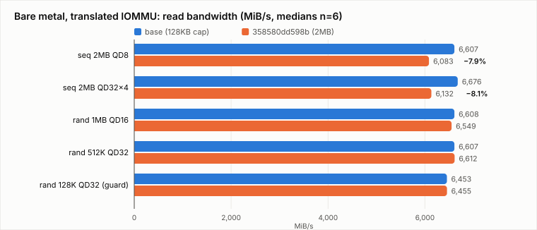
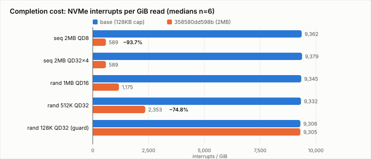
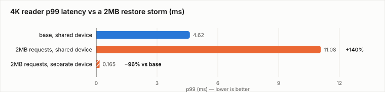
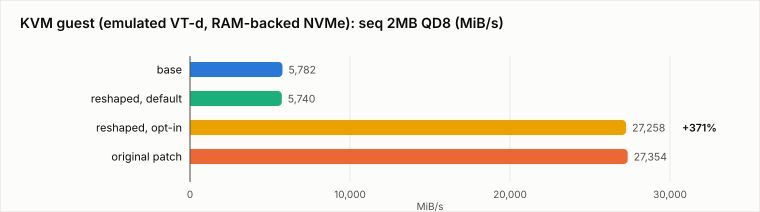

# The DMA-Optimal Clamp: measurement campaign and reshape

Analysis of `358580dd598b` ("nvme-pci: don't hard-cap max_hw_sectors by the DMA-optimal
size") and the two-patch series that replaces it. Measured 2026-08-11/12 on a Latitude.sh
`m4-metal-medium` (EPYC 9124, AMD-Vi) plus KVM guests on the same host.
Figures in `dma-opt-clamp-figs/`.

## Verdict

The original commit's analysis is correct and its mechanism works exactly as designed —
but its **default** is wrong on real hardware: −8% large-block streaming and a 2.4x
small-IO p99 penalty under mixed load on an enterprise NVMe, while its measured wins
(+133…371% virtualized) live entirely in environments that can opt in. The reshaped
two-patch series keeps the ceiling lift, moves the DMA-optimal bound to the *default*
`max_sectors`, and validates bit-equivalent to stock by default and bit-equivalent to
the original patch behind one sysfs write — in both environments.

## 1. The patch under test

Commit `3710e2b056cb` ("nvme-pci: clamp max_hw_sectors based on DMA optimized
limitation") capped NVMe transfer size at `dma_opt_mapping_size()` — on a translated
IOMMU domain that is 128KB, the largest IOVA range-cache size class. Anything larger
allocates and frees its IOVA through the global `iova_rbtree_lock`, a genuine
scalability wall when every scatterlist segment paid its own allocation.

The cost model inverted when `7ce3c1dd78fc` moved nvme-pci onto the scatterlist-less
DMA helpers (`858299dc6160`): a request is now mapped with a **single IOVA allocation
covering the whole transfer**. Splitting a 1MB transfer into 8x128KB requests now costs
seven more allocations — plus seven more submissions, completions, and interrupts —
than the unsplit request. `358580dd598b` therefore replaced `dma_opt_mapping_size()`
with `dma_max_mapping_size()` in the `max_hw_sectors` computation: one line, lifting
the cap from 128KB to the MDTS bound.

Its KVM numbers (+133% on 2MB sequential reads, +89% on 512K random) are real. The
campaign's question: what happens on real hardware, where completions are MSI-X
messages instead of vmexits?

## 2. Test rig and methodology

- **Host**: Latitude.sh m4-metal-medium — EPYC 9124 (Zen 4, 16C/32T), 128GB, Dallas,
  $1.25/hr. AMD-Vi active, default domain **Translated, DMA-FQ lazy** (verified
  per-boot from the test device's IOMMU group type).
- **Test media**: 2x blank Samsung PM9A3 1.9TB (OS on separate 480GB Microns).
  MDTS = 2^9 pages = 2MB. First 100GiB preconditioned once (sequential fill); timed
  runs are read-only against that region (the write-shaped case and blktests use the
  scratch drives by design).
- **Kernels** (tip v7.2-rc1, one variable per comparison, same config):
  `iovabase` = `358580dd598b~1`; `iovapatch` = + the original commit;
  `iovaopt` = + the reshaped 2-patch series; `iovaopt-ls` = iovaopt + `CONFIG_LOCK_STAT`
  (diagnostics only).
- **Discipline**: strictly serial boots (never concurrent with builds), rotated
  A/B/A/B boot order, kernel identity gated on `uname -r` before every run, per-boot
  gates (`max_hw_sectors_kb`, `max_sectors_kb`, IOMMU domain type, MDTS), dmesg
  scanned per boot, NVMe interrupts counted from `/proc/interrupts` deltas per case.

## 3. The benchmarks in detail

All cases: fio, `ioengine=io_uring`, `direct=1` against the raw block device, 20s
`time_based` runs after 3s ramp, `norandommap`, 3 reps per boot, medians across boots.
Large-block cases use `iomem=mmaphuge` (hugepage-backed, physically contiguous buffers)
so the NVMe 256-segment budget never confounds the sector-limit variable — a 2MB
scattered-4K buffer would split at 1MB on segments alone.

### 3.1 Block-size sweep (the core matrix)

| case | fio shape | what it isolates |
|---|---|---|
| `seq2m_qd8` | bs=2M rw=read QD8, 1 job | streaming at moderate depth — the headline |
| `seq2m_qd32x4` | bs=2M QD32 x 4 jobs, disjoint 25G regions | streaming at saturation |
| `rand1m_qd16` | bs=1M randread QD16 | above-boundary, mid size |
| `rand512k_qd32` | bs=512k randread QD32 | above-boundary, small-large |
| `rand128k_qd32` | bs=128k randread QD32 | **guard**: exactly at the rcache bound |
| `rand4k_qd32x8` | bs=4k randread QD32 x 8 jobs | **guard**: IOPS path (915K IOPS) |

Metrics per case: bandwidth, IOPS, p50/p99 completion latency, usr/sys CPU,
interrupts/GiB.

### 3.2 KV-cache-shaped workloads, and what they model

These emulate the **I/O pattern of KV-cache offload to NVMe** in the host-DRAM staging
path — the way vLLM/LMCache-class serving stacks ship today without GPUDirect: KV
blocks for evicted sequences are dumped to NVMe, and pulled back through pinned host
buffers on sequence resume, while the serving process keeps issuing unrelated small
reads. The emulation is faithful to shape, concurrency, buffer type, and I/O
discipline; it is not an inference stack (no GPU, no attention compute, no H2D
copies — deliberately, since the patch only touches the NVMe request path).

| case | fio shape | KV pattern it mirrors |
|---|---|---|
| `kv_restore` | 16 jobs x QD2 x 2MB randread | 16 sequences resuming concurrently; each job = one sequence pulling its KV extents (a 2MB extent ≈ a layer's contiguous block span for a few-thousand-token context). QD2/job models restore pipelining; the metric that matters is **whole-extent p50/p99** — the TTFT (time-to-first-token) proxy, since a resumed sequence can't prefill until its KV arrives. |
| `kv_prefix` | 8 jobs x QD4 x 1MB seq read, disjoint 12G regions | prefix-cache reload: shared system-prompt/context KV streamed back sequentially per stream, several tenants at once. |
| `kv_qos` | 4 jobs x QD8 x 2MB randread + 2 jobs x QD16 x 4K randread, same device, per-job stats | the interference case: bulk restores sharing a device with latency-sensitive small I/O (index/metadata lookups, embedding fetches, other tenants). The 4K job's p99 is the headline number. |
| `kv_evict` | 4 jobs x QD8 x 2MB write | eviction flush — sequences demoted to NVMe under memory pressure (the write half of the offload cycle). |

#### kv_restore — concurrent sequence resume (the TTFT case)

16 jobs x QD2 x 2MB random reads. Each fio job plays one evicted sequence being
resumed: its 2MB reads are that sequence's KV extents (a contiguous block span of a
few thousand tokens' keys/values as a contiguous-block allocator lays them out), and
QD2 models modest pipelining — fetch the next extent while the current one lands.
Sixteen jobs is a burst of returning conversations hitting the drive at once. The
metric that matters is **whole-extent completion latency**: a resumed sequence cannot
start prefill until its KV is back, so extent p99 is the time-to-first-token proxy.
Found: unsplit 2MB commands improve extent p99 by 32% (16.3→11.1ms — no sub-request
jitter) but worsen the median 23% and lose 6.3% aggregate bandwidth.

#### kv_prefix — prefix-cache reload

8 jobs x QD4 x 1MB *sequential* reads, each in its own disjoint 12GB region. The
shared-prefix case: system-prompt and common-context KV written out once,
contiguously, streamed back in order when a cold prefix-cache entry is pulled —
several tenants' streams concurrently. Sequential by construction, because that is
how prefix KV is laid down and read back. Found: flat (−0.9%) — streaming reload is
indifferent at these sizes.

#### kv_qos — restores vs latency-sensitive small I/O (the interference case)

One fio invocation, two heterogeneous job groups on the *same* device, reported
per-job: `qos_big` = 4 jobs x QD8 x 2MB randread (the bulk restore traffic), and
`qos_small` = 2 jobs x QD16 x 4K randread (everything small and latency-sensitive
that shares a device in practice — block-table/metadata lookups, embedding fetches,
another tenant). The headline metric is the 4K job's p99 *while the storm runs*.
This test found the original commit's worst liability: with unsplit 2MB commands the
4K readers' p99 goes 4.62→11.08ms (+140%) and their IOPS drop 59% — their median
wait becomes one whole 2MB command service time, where 128KB splitting had provided
sixteen interleave points per big I/O. The cross-device variant (storm on drive A,
4K on drive B) drops the 4K p99 to 165µs, proving the interference is same-device
queue contention only — hence per-device opt-in as the documented mitigation.

#### kv_evict — eviction flush (the write half)

4 jobs x QD8 x 2MB writes into disjoint 25GB regions of the scratch drive —
sequences demoted to NVMe under KV memory pressure. The only write-shaped case (the
sector limit applies to writes identically), reported with an SLC-cache noise
caveat. Found: bandwidth identical (2681 MiB/s, drive write-limited), the same
median-up/tail-down latency reshuffle as reads, net neutral.

Fidelity choices worth naming: hugepage-backed buffers mirror the pinned, physically
contiguous staging buffers real stacks register for DMA; O_DIRECT + io_uring matches
their I/O engines; extent sizes (1–2MB) sit where per-sequence KV block spans land for
7–70B-class models with contiguous block allocators. Limits of the emulation: no
compute overlapping I/O, no H2D copy stage, and the "extent" is a single contiguous
read rather than a scatter of per-layer blocks — all of which sit *outside* the NVMe
request path this patch changes. All four ran on base and original-patch kernels;
`kv_qos` additionally ran in the reshaped kernel's two-phase validation (default ≡
base at 4620µs p99 exactly; opt-in ≡ old patch at 11,076µs exactly).

### 3.3 Isolation and attribution probes

- **Request-size isolation**: on the patched kernel, re-cap via
  `max_sectors_kb=128` and re-run the large-block cases. If numbers return to base,
  the deltas are pure request-size policy (they did, exactly).
- **Depth sweep**: 2MB at QD16/QD64, 1MB at QD64 — does deeper queueing recover the
  streaming loss? (It did not: 6109 MiB/s at both depths.)
- **Two-phase equivalence** (reshaped kernel): the key cases at default, then again
  after `echo 2048 > max_sectors_kb`, in one boot — default must equal base, opt-in
  must equal the original patch.

### 3.4 Guest matrix

vng (virtme-ng) guests on the same box: 14 vCPU, 8GB, emulated Intel vIOMMU
(`-machine q35 -device intel-iommu`, guest `intel_iommu=on iommu.passthrough=0`),
RAM-backed emulated NVMe (8GB urandom-filled image in tmpfs, `mdts=10` = 4MB) — the
original changelog's environment reproduced. Guest cases: `seq2m_qd8`,
`rand512k_qd32`, `rand4k_qd32x8` (15s runs), four kernel configs x 2 boot rounds.
The KV-QoS shapes were deliberately *not* run in the guest: arbitration behavior of a
RAM-backed QEMU device model would characterize the emulator, not any deployment.

### 3.5 Hardening tests

| test | setup | question |
|---|---|---|
| pt-guard | both kernels, `iommu=pt` (identity domain) | does the `opt < max` guard leave no-hint systems untouched? |
| cross-device QoS | opt-in 2MB storm on drive A, 4K QD16x2 on drive B | is the QoS cliff same-device only? |
| strict mode | `iommu.strict=1`, msk 128 vs 2048 | does synchronous invalidation favor fewer/larger requests? |
| rbtree lock_stat | LOCK_STAT kernel; 16 jobs x QD8 randread `bssplit=256k/25:512k/25:1m/25:2m/25`, 60s, one IOVA domain; `/proc/lock_stat` for `iova_rbtree_lock` | does the `3710e2b056cb` scalability wall reappear under designed-worst load? |
| blktests | `block` + `nvme` groups, second PM9A3, `max_sectors_kb=2048`, lockdep kernel | correctness beyond fio's happy path (resets, passthrough, multipath, error paths) |

## 4. Bare metal results: the original commit regresses its defaults

Gates held on every boot: base `max_hw_sectors_kb=128`, patched `2048`.

| case | base | patch | Δ | irq/GB Δ |
|---|---|---|---|---|
| seq 2MB QD8 (MiB/s) | 6607 | 6083 | **−7.9%** | −93.7% |
| seq 2MB QD32x4 (MiB/s) | 6676 | 6132 | **−8.1%** | −93.7% |
| randread 1MB QD16 (MiB/s) | 6608 | 6549 | −0.9% | −87.4% |
| randread 512K QD32 (MiB/s) | 6607 | 6612 | +0.1% | −74.8% |
| randread 128K QD32 (guard) | 6453 | 6455 | 0% | 0% |
| randread 4K QD32x8 (IOPS, guard) | 914,952 | 915,388 | 0% | 0% |

The mechanism is flawless — requests go out unsplit, completions collapse 16x, the
sub-cap guards are bit-identical. But at fixed user queue depth the old 128KB
splitting *amplified device-side parallelism* (QD8 x 2MB became ~128 in-flight NVMe
commands), and the PM9A3 tops out near 6.1GB/s on 2MB commands vs 6.6–6.7GB/s on
128KB streams.

### KV-shaped results (n=3)

| case | metric | base | patch | Δ |
|---|---|---|---|---|
| kv_restore | BW MiB/s | 6497 | 6086 | −6.3% |
| | extent p50 µs | 8454 | 10,420 | +23% |
| | extent p99 µs | 16,318 | 11,076 | **−32%** |
| kv_qos big | BW MiB/s | 1617 | 1450 | −10.3% |
| kv_qos small (shared device) | IOPS | 3676 | 1504 | **−59%** |
| | p99 µs | 4620 | 11,076 | **+140%** |
| kv_evict (write) | BW MiB/s | 2681 | 2681 | 0% |

The **QoS cliff**: 4K readers sharing the device with unsplit 2MB streams have their
median wait become one whole 2MB command service time. The **tail paradox**:
whole-extent p99 improves 32% (no sub-request jitter) even as the median worsens —
the one bare-metal latency argument in the original commit's favor, and directly
relevant to TTFT tails.

### Isolation probe

`max_sectors_kb=128` on the patched kernel returns **every** number to base exactly
(seq 2MB: 6603 vs 6607; sys% equal) — the regression is 100% request-size policy, not
mapping-path cost. Depth does not recover it (2MB @ QD16/QD64: 6109 MiB/s flat). The
rbtree cost appears only as +0.4–1.2pp sys at 512K–1M.

## 5. Why the rbtree wall no longer applies

The clamp in `3710e2b056cb` existed because IOVA allocation cost used to scale
*with* transfer size, on the I/O hot path, through one lock. All three of those
premises have inverted, which is what makes `dma_max_mapping_size()` safe again:

1. **The allocator-traffic arithmetic flipped sign.** Under the scatterlist regime,
   a larger transfer meant *more* mapping work. Under `blk_rq_dma_map`
   (`858299dc6160`), a request is one IOVA allocation regardless of size, so
   allocator traffic is `bandwidth / request_size` — **inversely** proportional to
   request size. Lifting the cap from 128KB to 2MB *reduces* total allocator
   operations per byte moved by 16x; the "dangerous" configuration generates the
   least allocator traffic. A device would have to sustain 100K+ IOPS of >128KB
   requests — over 13GB/s through one device — to push even ~100K rbtree ops/s.
2. **The rate is bounded by device bandwidth, not host IOPS.** The rcache exists to
   absorb allocation rates in the hundreds-of-thousands-per-second range. Large
   requests structurally cannot reach such rates: at 2MB per command, a 14GB/s
   device issues ~7K allocations/s. The populations sort themselves correctly —
   high-rate small I/O stays entirely inside the rcache (measured: the 4K guard at
   915K IOPS shows zero rbtree traffic on either kernel), and only low-rate large
   I/O touches the tree.
3. **The lock is per-IOMMU-domain, i.e. per-device.** Each NVMe device's IOVA
   domain has its own `iova_rbtree_lock`, so adding devices adds locks; the
   original many-CPUs-one-lock convergence only occurs against a single device,
   where the bandwidth bound above already caps the rate.
4. **The frees left the hot path.** In the default lazy (DMA-FQ) mode, unmaps are
   deferred through the flush queue and freed in batches off the completion path —
   visible in the lock_stat capture, where `free_iova` contentions (30.7K) come
   from batched FQ drains, not per-IO completion-path stalls.

The empirical cap on all of this (§7): sixteen CPUs hammering one domain for 60
seconds with *every* request above the rcache bound — the designed-worst pattern —
produces 1.17µs average contended wait and ~0.005% of CPU time on the lock, versus
the original changelog's own KVM measurement of 2.0µs and 0.2%. The wall is not
merely improbable; the workload that could rebuild it can no longer be constructed
through this driver.

## 6. Why a reshape, not a revert

The hard cap is the wrong mechanism regardless of the numbers: `max_hw_sectors` is a
ceiling, and baking policy into it denies administrators any choice, while every
regression above is recoverable with one sysfs write. Implementation constraints:
`blk_validate_limits()` always recomputes `max_sectors` (drivers cannot set it
directly); `37105615f731` deliberately removed small-`io_opt` clamping — which, as a
side-find, means **SCSI's SAS `opt_sectors` → `io_opt` clamp has been silently inert
since then**; and `max_user_sectors` belongs to the sysfs path. Hence a new limit.

### The two patches

1. **`block: let drivers cap the default max_sectors`** — adds
   `queue_limits.max_default_sectors`, honored only in the fallback branch of the
   `max_sectors` computation (`min_not_zero` against `BLK_DEF_MAX_SECTORS_CAP`). Can
   only lower the default; user setting overrides up to `max_hw_sectors`.
2. **`nvme-pci: cap the default transfer size at the DMA-optimal size`** —
   `max_hw_sectors` = min(`NVME_MAX_BYTES`, `dma_max_mapping_size()`);
   `dma_opt_mapping_size()` → `ctrl->opt_transfer_sectors` → the default cap, set only
   when `opt < max` (the SAS "genuine hint" guard). Non-PCI transports and
   passthrough/direct-DMA systems untouched.

Patch files: `0001-block-max-default-sectors.patch`,
`0002-nvme-pci-default-cap.patch` (checkpatch-clean, W=1 clean).

### Equivalence validation (bare metal)

Gate: `max_hw_sectors_kb=2048` **and** `max_sectors_kb=128` simultaneously.

| metric | base | reshaped dflt | Δ | old patch | reshaped opt-in | Δ |
|---|---|---|---|---|---|---|
| seq 2M QD8 MiB/s | 6607 | 6610 | +0.0% | 6082 | 6057 | −0.4% |
| seq 2M QD8 irq/GB | 9362 | 9354 | −0.1% | 589 | 589 | +0.0% |
| rand 1M QD16 irq/GB | 9345 | 9360 | +0.2% | 1175 | 1175 | +0.0% |
| rand 4K guard IOPS | 914,952 | 915,493 | +0.1% | 915,388 | 915,894 | +0.1% |
| QoS small 4K p99 µs | 4620 | 4620 | +0.0% | 11,076 | 11,076 | +0.0% |

## 7. The virtualized win, reproduced first-party

| case | base | reshaped dflt | reshaped opt-in | old patch |
|---|---|---|---|---|
| seq 2M QD8 MiB/s | 5782 | 5740 | **27,258** | 27,354 |
| seq 2M QD8 p99 µs | 4981 | 4981 | **823** | 815 |
| rand 512K QD32 MiB/s | 5743 | 5794 | **9386** | 9332 |
| rand 4K guard IOPS | 77,402 | 76,213 | 77,706 | 77,555 |

**+371%** on 2MB sequential and **+63%** on 512K random through the opt-in — larger
than the original +133%/+89% because this host's vmexit path is pricier relative to
tmpfs bandwidth. Both equivalences hold in the guest too.

## 8. Hardening results

- **pt-guard**: both kernels under identity domains show `2048/2048`, identical
  (~6.0GiB/s). The guard correctly leaves no-hint systems alone — and **passthrough
  systems already run 2MB default requests today**; the 128KB default only ever
  existed behind translated IOMMUs. Translation overhead itself: <0.5%.
- **Cross-device QoS**: 4K on drive B runs at **p99 = 165µs / 188K IOPS** while
  drive A absorbs the full opt-in storm (vs 11,076µs shared) — the cliff is strictly
  same-device; a per-queue knob permits exactly the per-device opt-in that avoids it.
- **Strict mode (negative result)**: no rescue for bare-metal opt-in — seq keeps the
  −8% shape at equal sys%; 512K costs ~+4pp sys at equal bandwidth. The tradeoff is
  completion-cost-driven, not invalidation-driven.
- **rbtree lock_stat** (16-way, all requests > rcache, 60s):
  `iova_rbtree_lock` — 1,076,721 acquisitions, 38,676 contentions, **1.17µs average
  wait, 58µs max ≈ 0.005% of CPU time** (vs 129 contentions at default). `free_iova`
  dominates contentions (30.7K vs 8.6K) — the lazy flush-queue batching. The
  2022-era wall does not reappear.
- **blktests** (`block` + `nvme`, opt-in limit, lockdep kernel): **72 passed,
  0 failed, 47 skipped** (missing optional debug configs/tools), **zero dmesg
  findings** including lockdep. Two initial failures were missing userspace tools on
  the fresh box (`xfs_io`, a liburing helper); both pass after installing them.
- **Second drive model (Micron 7450, via file over md-raid1)**: the spare-drive
  assumption failed (both 480GB Microns carry the OS mirror), so this is a
  directional test — a 30GB file written through the filesystem, read back
  O_DIRECT, with `max_sectors_kb` toggled on both legs *and* md0 (md's stacked
  limit is frozen at assembly). Reads stripe across both mirror legs (~9.1GiB/s
  aggregate). Result, msk=128 vs 4096, medians n=3:

  | case | 128KB requests | 4MB-capable requests | Δ |
  |---|---|---|---|
  | seq 2MB QD8 — MiB/s | 9078 | 9107 | +0.3% |
  | seq 2MB QD8 — sys % | 24.7 | 6.9 | **−72%** |
  | rand 512K QD32 — MiB/s | 6341 | 6336 | −0.1% |
  | rand 512K QD32 — sys % | 26.4 | 17.0 | −36% |

  Two upgrades to the findings: the PM9A3's −8% streaming loss **does not
  reproduce** on this controller (bandwidth flat), making the regression
  drive-specific rather than universal; and this is the campaign's **first
  measured bare-metal CPU win** — through a stacked fs+md+nvme path, where
  per-request software cost is real, 16x fewer requests cut streaming sys time
  3.6x at identical bandwidth. Caveats: file+md path rather than a clean raw
  device A/B, and both legs share one enclosure.

## 9. Complete ledger and recommendation

| environment / shape | original patch (default flip) | reshaped series |
|---|---|---|
| bare metal, large-block streaming | −8% | 0% (opt-in available) |
| bare metal, mixed-load 4K p99 | +140% (4.6→11.1ms) | 0% (isolable per-device) |
| bare metal, interrupts/GB at 2MB | −94% | −94% behind opt-in |
| KV extent restore p99 | −32% | −32% behind opt-in |
| virtualized, 2MB sequential | +371% | +371% behind opt-in |
| virtualized, 512K random | +63% | +63% behind opt-in |
| 4K / 128K guards, everywhere | 0% | 0% |
| passthrough / direct DMA | 0% (no clamp existed) | 0% (guard) |

The original commit should not merge as-is: its default trades measured regressions on
mainstream enterprise NVMe for wins its own environment cannot collect. The reshaped
series preserves every win behind a one-line opt-in (`max_sectors_kb`, or a udev rule
in guest images), keeps every default bit-identical, and turns the campaign's negative
results into the changelog's supporting evidence. Honest scope statement: on tested
hardware, unqualified throughput wins are virtualized-only; bare metal gets a measured
extent-tail win (−32% p99), a measured CPU-efficiency win on stacked storage paths
(−72% streaming sys time through fs+md-raid1 on the Micron 7450 at flat bandwidth),
and large counter-level savings (interrupts, mapping ops) that did not convert to
anything on the raw-device path of this machine class. The −8% loss is
drive-specific: it appears on the PM9A3 and does not reproduce on the Micron 7450
(n=2, split) — which strengthens per-device opt-in as the right granularity.
Follow-up candidate: convert SCSI's SAS `opt_sectors` to the new limit, un-breaking
it.

## 10. Reproduction notes

- Latitude's preinstalled `bnxt_en` DKMS breaks `make install` on rc kernels via the
  postinst hook — install boot files manually + `update-initramfs`; in-tree bnxt_en
  serves the NIC.
- `localmodconfig` on bare metal strips virtio/9p — force them back as builtins if
  kernels double as vng guests (guest root panics otherwise).
- vng: `--qemu-opts=` needs the equals form; `intel-iommu` requires prepending
  `-machine q35`; emulated VT-d works fine on AMD hosts.
- fio: options after a `--name` are job-local — in multi-job invocations, globals
  (`--filename` etc.) must precede the first `--name`, or later jobs silently fail.
- 2MB requests need segment headroom: `NVME_MAX_SEGS`=256, so scattered 4K buffers
  split at 1MB regardless of sector limits — hugepage-backed buffers keep the
  variables separated.
- Never run timed guest boots concurrently with builds (5–10x timing inflation).
- `pgrep -f` inside an ssh `sh -c` wrapper matches the wrapper's own cmdline — don't
  build completion-watchers on it.
- blktests on a fresh box needs `git`, `xfsprogs`, `liburing-dev`, and `column`
  (bsdmainutils) or tests fail/degrade for tooling reasons.
- md-raid stacked queue limits are frozen at assembly: raising a member's
  `max_sectors_kb` does nothing until `md0`'s own `max_sectors_kb` is raised too.
- Campaign totals: ~30 bare-metal boots, 9 guest boots, 5 kernel configs, 6 workload
  families, ~19 hours of a $1.25/hr machine.
