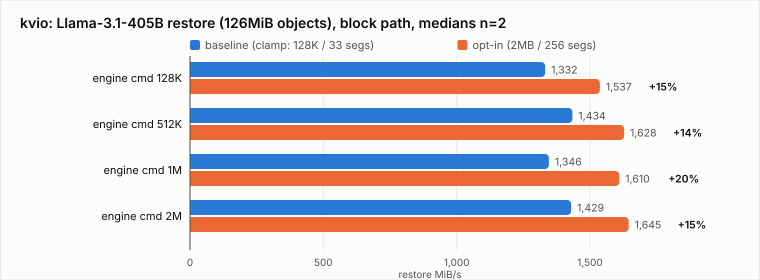

# kvio: an independent check of the DMA-optimal limit

[kvio](https://github.com/SamsungDS/ebpf-syscall/blob/ebpf-fixes/docs/kvio.html)
projects the NVMe I/O a real LLM KV-cache offload would issue — from model
geometry alone, no GPU — and executes it against a real device through
LMCache's `raw_block` engine (POSIX, io_uring, or `io_uring_cmd` passthrough),
with an eBPF monitor to validate projection against wire commands.


## Setup

- Host: EPYC 9124, AMD-Vi translated (DMA-FQ), blank Samsung PM9A3 (MDTS 2MB).
- Kernels: `kvbase` (tip v7.2-rc1) vs `kvopt` (+ the two-patch series, opted in).
- Model: **meta-llama/Llama-3.1-405B** — the largest KV object in
  [kvcache.io's projections](https://kvcache.io/io-projections.html): 126
  layers x 8 KV heads x 128 head_dim x bf16 x 256-token chunk =
  **132,120,576 B (126 MiB) per offload block**. kvio's catalog geometry, the
  kvcache.io projection, and an independent derivation agree byte-for-byte.
- Workload: 2 chunks x 2 iterations + warmup, block device, io_uring,
  O_DIRECT; engine command size (`--mdts-bytes`) swept 128K → 2M; 2 reps.

## Finding 1: the segment budget, not the sector limit, caps scattered I/O at 1MB

The per-boot gates showed a difference the fio campaign never measured:

| kernel | `max_hw_sectors_kb` | `max_sectors_kb` | `max_segments` | binding limit for 4K-scattered I/O |
|---|---|---|---|---|
| kvbase | 128 | 128 | 33 | **128 KB** (sectors) |
| kvopt | 2048 | 2048 | 256 | **1 MB** (segments) |

nvme-pci *derives* the segment limit from the transfer limit
(`drivers/nvme/host/core.c`):

```c
static u32 nvme_max_drv_segments(struct nvme_ctrl *ctrl)
{
	return ctrl->max_hw_sectors / (NVME_CTRL_PAGE_SIZE >> SECTOR_SHIFT) + 1;
}
lim->max_segments = min_t(u32, USHRT_MAX,
	min_not_zero(nvme_max_drv_segments(ctrl), ctrl->max_segments));
```

On the clamped kernel this is not an extra restriction: 128KB/4KB + 1 = 33 is
exactly the segment count a 128KB page-granular transfer can need, so the
sector limit binds and the segment limit is slack. (It binds only for
sub-page-fragment scatter lists — 33 segments of 512B is 16KB — which is rare
in practice.)

The interesting case is the **opted-in** kernel. There the PRP-derived bound
would be 513, but `ctrl->max_segments` is `NVME_MAX_SEGS` = 256
(`NVME_CTRL_PAGE_SIZE / sizeof(struct nvme_sgl_desc)` = one SGL descriptor
page), so 256 wins. With ordinary 4K-scattered buffers that caps a command at
**1 MB — half of what the lifted sector limit allows**. Raising
`max_sectors_kb` to 2048 therefore does *not* by itself produce 2MB commands
unless the buffer is physically contiguous, which is precisely the contiguity
requirement the fio study found from the other direction (the superpage cliff)
and which Finding 3 shows as an outright `EINVAL` on the passthrough path.

Worth noting what the limit is really made of: `NVME_MAX_SEGS` bounds *SGL*
descriptors, and the driver's own comment says "for PRPs, segments don't
matter at all" — PRP lists chain (`NVME_MAX_NR_DESCRIPTORS` = 5 x
`PRPS_PER_PAGE` = 511, ~10MB worth). The 256 cap is applied to every request
regardless of which format it will use. See "What can be done" below.

## Finding 2: the block-path A/B — restores gain 13-20%, stores are flat



Medians of 2 reps, 126 MiB objects:

| engine cmd size | load (restore) MB/s |  | store MB/s |  |
|---|---|---|---|---|
| | kvbase | kvopt | kvbase | kvopt |
| 128 KiB | 1332 | **1537** (+15.3%) | 678 | 700 (+3.2%) |
| 512 KiB | 1434 | **1628** (+13.5%) | 709 | 713 (+0.5%) |
| 1 MiB | 1346 | **1610** (+19.6%) | 695 | 704 (+1.4%) |
| 2 MiB | 1429 | **1645** (+15.1%) | 687 | 698 (+1.6%) |

Restore bandwidth improves in every configuration tested (4/4, +13.5% to
+19.6%); store bandwidth is flat within noise, as the fio campaign also found
(the drive's write path is the bottleneck either way). Per-point variance is
high — individual reps differ by up to 20% on the clamped kernel — so the
magnitude is soft, but the direction is unanimous.

Note the shape: performance is roughly flat *across* engine command sizes
within each kernel. That is the point. The engine asks for 2MB commands; the
kernel decides what actually reaches the device. On `kvbase` everything
collapses to ≤128KB / 33 segments no matter what the application requests; on
`kvopt` the same requests reach the device as up to 1MB commands
(segment-bound at 256 x 4KB). **Application-level tuning cannot escape the
kernel limit — only the kernel knob can.**

## Finding 3: under virtualization the real stack lands in the *scattered* regime — and THP is not enough

The fio side of this study established that in a shadow-vIOMMU guest the
opt-in is worth ~10x for 2MB requests **from physically contiguous buffers**,
and only ~17% from `malloc` buffers ([study §7.3](README.md)). kvio answers
what that leaves open: which regime does a real KV stack's own allocator land
in?

Running kvio *inside* the shadow-vIOMMU guest (same passed-through PM9A3,
both kernels, LMCache's real `raw_block` engine and its real buffers):

| | baseline | opt-in | Δ |
|---|---|---|---|
| load (restore) | 485 MB/s | **655 MB/s** | +35% |
| store | 491 MB/s | 633 MB/s | +29% |

Flat across 2MB and 128KB engine command sizes, as everywhere else — the
kernel limit decides, not the application's request size. The absolute value
is the answer: **655, not ~6100.** Calibrated against fio on the identical rig
(hugepage 2MB = 6105, `malloc` 2MB = 607), LMCache's buffers are firmly in the
page-scattered regime. A real KV serving stack does **not** collect the 10x
virtualized win automatically; it collects a respectable +35%.

**Transparent huge pages do not close the gap.** The guest ran with
`transparent_hugepage=always` throughout, and a same-boot control makes the
point cleanly:

| configuration | restore |
|---|---|
| kvio, THP=always | 634 MB/s |
| kvio, THP=madvise (no THP) | 475 MB/s |
| **fio, explicit hugepage buffers (same boot)** | **6058 MiB/s** |

THP is worth ~33% (475 → 634) — some physical contiguity does accrue — but it
does not reach the superpage regime an order of magnitude above. The likely
reason is alignment rather than contiguity: an IOMMU superpage needs a
2MB-aligned physical extent mapped at a 2MB-aligned IOVA, and a THP-backed
allocation from a general-purpose allocator reliably provides neither.
(Measured fact: THP=always does not reach the cliff. Mechanism: inferred, not
instrumented.)

Practical consequence for KV-offload on virtualized hosts: staging buffers
must be **explicitly** hugepage-backed — `MAP_HUGETLB`, a preallocated
2MB-aligned pinned pool, or equivalent — to collect the large win. Enabling
THP and hoping is not enough, and the gap between the two paths is 10x.

## Finding 4: 2MB passthrough fails even with the ceiling lifted

With `--engine uring_cmd --mdts-bytes 2097152` on `kvopt` (max_hw = 2MB):

```
RawBlockCore write failed ...: [Errno 22] io_uring I/O error
```

`EINVAL`, not a sector-limit rejection: a 2MB transfer from a page-scattered
buffer needs 512 segments, and `NVME_MAX_SEGS` is 256. Passthrough
(`io_uring_cmd`) bypasses `max_sectors` entirely — `blk_rq_map_user_iov()`
bounds it by `max_hw_sectors` — so the series' ceiling lift *does* change
passthrough behavior by default, but the segment budget still caps a scattered
2MB command. Reaching 2MB commands needs physically contiguous (hugepage)
buffers, exactly as on the fio side.

## Finding 5 (suite limitation): the passthrough engine wedges at ~1000 commands

`--engine uring_cmd` with the default 128KB command size hangs indefinitely on
a 126 MiB object (1008 commands): the process blocks with **zero device
inflight** and load average 0.00, and never returns. It is not the kernel —
no I/O is outstanding, dmesg is clean, and the same object completes in
milliseconds through the block-device io_uring engine. Reproduced on both
kernels. The passthrough numbers in this document are therefore limited to
the single-command-size cases that complete; the wire-validation step
(`kvio_validate.py`) could not be exercised, since it needs a completed
passthrough capture.

A second, smaller gotcha: `--mdts-bytes` defaults to 131072, so a naive
`kvio` A/B feeds *both* kernels 128KB commands and measures nothing about the
kernel's limit. The engine's split must be raised above the boundary under
test.

## What this adds to the study

1. **Independent confirmation** that the clamp costs real bandwidth on
   KV-restore-shaped I/O at production object sizes — from a different tool,
   a different I/O engine, and the largest model geometry in circulation.
2. **A refinement of the opt-in's reach**: even opted in, 4K-scattered
   buffers cap at 1MB per command (256 segments), not the 2MB the sector
   limit allows. Contiguous buffers are required to use the full ceiling —
   the same conclusion the superpage cliff reached from the other side.
3. **Corroboration of the contiguity requirement** from the opposite
   direction: fio showed the superpage cliff needs hugepages; kvio shows a
   scattered 2MB command is rejected outright by the segment budget.
4. **The decisive deployment datapoint**: a real KV stack, run unmodified in
   a shadow-vIOMMU guest, lands in the scattered regime (+35%), not the
   superpage regime (10x) — and THP=always does not change that. Collecting
   the large virtualized win requires explicitly hugepage-backed staging
   buffers.
5. A reminder that **application-level request sizing cannot compensate**:
   sweeping the engine's command size changed almost nothing within a kernel,
   while changing the kernel moved every point.

## Reproduction

```sh
git clone -b kvio https://github.com/mcgrof/LMCache && cd LMCache
# rust ext: (cd rust/raw_block && maturin develop --release)
python examples/kv_cache_offload_io/run_kv_offload_io.py \
    --model meta-llama/Llama-3.1-405B --dtype bfloat16 \
    --chunk-tokens 256 --num-chunks 2 --iters 2 --warmup 1 \
    --device /dev/nvme2n1 --engine io_uring --odirect --mdts-bytes 2097152
```

Deps beyond the documented list (LMCache 0.5.x pulls them in transitively):
`msgspec sortedcontainers requests prometheus_client py-cpuinfo psutil
aiohttp numba aiofile pyzmq transformers`. Raw logs for both kernels:
`data/kvio-final.tgz`.

## What can be done about the 256-segment cap

The cap is `NVME_MAX_SEGS` — one SGL descriptor page's worth of entries —
applied unconditionally, even though the driver notes that PRP-format
requests have no such limit (PRP lists chain across
`NVME_MAX_NR_DESCRIPTORS` pages, ~10MB of coverage). Three options, in
increasing order of ambition:

1. **PRP-only controllers could use the PRP bound.**
   `nvme_pci_get_virt_boundary()` already returns `NVME_CTRL_PAGE_SIZE - 1`
   when the controller lacks SGL support, so the block layer guarantees every
   request is page-gap-free and therefore PRP-expressible. For those
   controllers `NVME_MAX_SEGS` is irrelevant and `max_segments` could be
   `nvme_max_drv_segments()` (513 at a 2MB ceiling), letting scattered
   buffers reach the full transfer size. Contained change, no new failure
   modes: such devices never build an SGL.
2. **SGL-capable controllers could fall back to PRP above 256 segments.**
   `nvme_pci_use_sgls()` already chooses per request; adding "and the request
   fits an SGL descriptor page" would let `max_segments` rise for everyone.
   The catch is requests that *require* SGL (page gaps within the
   controller's mask, which PRP cannot express); those must still be split at
   256, and `queue_limits` has only one number, so this needs either a
   conservative limit for gap-capable queues or a split hint the block layer
   does not have today.
3. **Chain SGL segments.** SGL supports segment descriptors that chain like
   PRP lists; the driver deliberately supports "a single descriptor's worth".
   Lifting that is the most general fix and the most invasive.

Option 1 is now **implemented and verified** as patch 3/3 of the series
("nvme-pci: don't apply the SGL segment limit to PRP-only controllers"). On
the PM9A3 (`sgls == 0`): `max_segments` goes 256 → 513, and 2MB O_DIRECT
reads from `malloc` buffers stop splitting — interrupts/GB drop from ~1230
to ~660, converging on the contiguous-buffer figure, with slightly lower
sys%. Honest caveat from the A/B: raw bandwidth at QD8 on this drive was ~7%
*higher* with the splits (two 1MB commands pipeline better than one 2MB
command there), so the fix is an efficiency/limit-correctness win, not a
bandwidth win per se — and it matters on stock kernels too, since
identity-mapped systems already run `max_hw_sectors` at MDTS today. Options
2 and 3 remain worth raising with the nvme maintainers — the SGL-required
cases are the crux.
