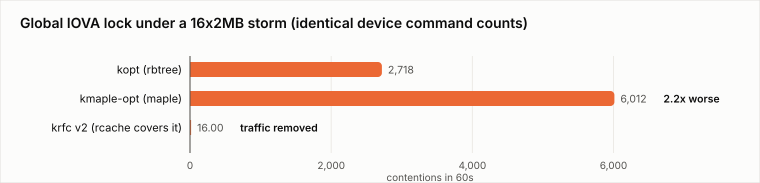
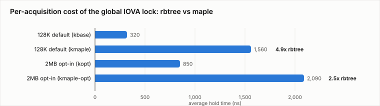
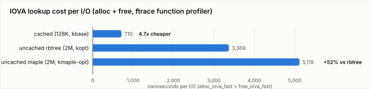
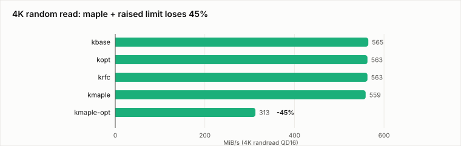

# Benchmarking the IOVA maple-tree conversion

[Rik van Riel's "convert iova to maple tree"](https://lore.kernel.org/all/20260624030853.2340880-1-riel@surriel.com/)
(v4, June 2026, 3 patches) replaces the IOVA rbtree with a maple tree,
motivated by production soft lockups at Meta: *"when enough CPUs at a time
fall into the linear search trap, systems have been known to get stuck for so
long that it causes soft lockups"*. It makes `alloc_iova()` O(log n) while
keeping the other operations at their existing complexity.

This document benchmarks it on the rig used throughout
[this study](README.md), against the same reference points: baseline, the
`max_sectors_kb` opt-in series, and the
[per-domain rcache RFC](rfc-benchmarks.md).

**Summary**: on this hardware the conversion is behaviourally neutral at
stock defaults, as designed — but under the large-transfer workloads this
study cares about it makes the global lock **more** expensive, not less:
2.2× the contentions, 2.5× the hold time, and a worst-case wait of **1.04ms**
against 11µs for the rbtree. A 45% loss on 4K random reads seen in the
campaign suite did **not** reproduce under a dedicated investigation and is
not attributed to the conversion (see below). None of this
contradicts the series' own goal — it targets search complexity on
fragmented domains, which this rig does not reproduce — but it does mean the
two approaches are not interchangeable, and that a maple-based allocator
still needs the rcache to keep traffic off the tree.

## Method

One box (EPYC 9124 16C/32T, Samsung PM9A3 behind AMD-Vi in DMA-FQ mode,
upstream v7.2-rc1 base), five kernels built from one config, ten verified
boots:

| kernel | patches | default transfer limit |
|---|---|---|
| `kbase` | none | 128K (the 3710e2b056cb clamp) |
| `kopt` | 3-patch opt-in series | 128K, admin raises to 2MB |
| `krfc` | 6-patch per-domain rcache RFC | 2MB, self-sized |
| **`kmaple`** | **maple v4** | 128K |
| **`kmaple-opt`** | **maple v4 + opt-in series** | 128K, admin raises to 2MB |

Performance and energy came from clean kernels; lock tables from separate
`CONFIG_LOCK_STAT` builds, never mixed. Every lock comparison is validated
by `nvmeq->sq_lock` acquisition counts, so the arms are known to have issued
the same number of device commands. Medians of n=3; preconditioned device,
hugepage-backed buffers.

## Throughput: neutral at defaults, neutral under the opt-in

| case | kbase | kopt | krfc | **kmaple** | **kmaple-opt** |
|---|---|---|---|---|---|
| seq 2M QD8 | 6611 | 6099 | 6098 | **6610** | **6133** |
| rand 2M QD8 | 6616 | 6090 | 6091 | **6616** | **6121** |
| kv_restore (16×QD2×2M) | 6516 | 6090 | 6090 | **6518** | **6091** |
| kv_restore p99 | 17.7ms | 10.9ms | 11.1ms | **18.2ms** | **11.1ms** |
| rand 512K QD32 | 6613 | 6615 | 6615 | **6613** | **6616** |
| **rand 4K QD16** | 565 | 563 | 563 | **559** | **313** |
| kv_qos 4K victim p99 | 4.8ms | 21.6ms | 21.6ms | **4.8ms** | **21.9ms** |

`kmaple` tracks `kbase` to within 0.1% on every case except 4K (−1%), which
is the expected result: the conversion changes the tree, not the transfer
limit, so at stock defaults everything still fits the rcache and the tree is
barely touched. `kmaple-opt` tracks `kopt` on every large-transfer case
(within 0.6%), including the PM9A3's at-MDTS dip and the halved kv_restore
tail. The maple conversion neither helps nor hurts throughput here.

The exception is 4K, below.

## Lock behaviour: the tree gets more expensive, not less

16 jobs × 2MB × QD8, 60s, lock_stat around the storm only. `iova_lock` is
the maple series' rename of `iova_rbtree_lock`:

| | device cmds | tree acq | tree cont | worst wait | avg hold |
|---|---|---|---|---|---|
| `kbase` (128K) | 3,461,183 | 45,959 | 1,293 | 61.3µs | 0.32µs |
| `kmaple` (128K) | 3,459,047 | 45,304 | 2,181 | 57.6µs | **1.56µs** |
| `kopt` (2MB) | 209,433 | 436,326 | 2,718 | 11.1µs | 0.85µs |
| `kmaple-opt` (2MB) | 209,695 | 436,663 | **6,012** | **1038.8µs** | **2.09µs** |
| `krfc` v2 (2MB) | 209,036 | 46,228* | **16*** | 2.6µs* | 0.42µs* |

\* from the [RFC campaign](rfc-benchmarks.md) on the identical rig and
workload; see the provenance note at the end.

Acquisition counts match between rbtree and maple arms — the conversion
does not change *how often* the tree is touched, exactly as intended. What
changes is the cost of each touch: **4.9× the hold time at 128K** (1.56µs vs
0.32µs) and **2.5× at 2MB** (2.09µs vs 0.85µs), with contention rising in
step (1.7× and 2.2×). The worst single wait under the 2MB storm is **1.04ms
against 11µs** — a ~94× increase, and the kind of number that matters for the
soft-lockup case the series is trying to fix.

Two caveats, stated plainly. First, this rig's domains are not fragmented:
the linear search the series exists to eliminate barely fires here, so this
measures maple's *constant factors* on the paths that do run, not the
pathology it targets. On a fragmented 32-bit space the trade could invert
entirely. Second, `CONFIG_LOCK_STAT` instruments every acquisition and its
overhead falls on hold time; it is applied identically to both arms, so the
*ratio* is meaningful even if the absolute microseconds are inflated.

The third row is the structural point: whatever the tree's per-operation
cost, the RFC arm barely touches it — 16 contentions against 2,718 (rbtree)
and 6,012 (maple) for the same 209K device commands. Optimizing the tree and
removing the traffic are complementary, and on this workload removing the
traffic dominates by two orders of magnitude.

## Lookup latency: what each path actually costs per call

The ftrace function profiler was run over the same 16×2MB storm with a filter
on the four entry points, giving per-call averages and hit counts:

| kernel | `alloc_iova_fast` | `free_iova_fast` | per I/O | slow path taken |
|---|---|---|---|---|
| `kbase` (128K, cached) | 422 ns | 288 ns | **710 ns** | 0.2% |
| `kopt` (2MB, rbtree) | 2295 ns | 1074 ns | **3369 ns** | 99.0% |
| `kmaple-opt` (2MB, maple) | 3055 ns | 2064 ns | **5119 ns** | 98.9% |

The hit-rate column is the mechanism in one number: at 128K the cache serves
99.8% of allocations (8,173 slow-path calls out of 3.45M), while at 2MB
without cache coverage 99% of them reach the tree. **A cached lookup costs
710 ns per I/O against 3369 ns uncached — 4.7× cheaper**, or about 2.66 µs of
CPU returned per I/O, ~535 ms of CPU time over this 60-second storm.

Isolating the tree implementations on their own calls:

| slow-path call | rbtree | maple | |
|---|---|---|---|
| `alloc_iova` | 1828 ns | 2629 ns | **+44%** |
| `free_iova` | 831 ns | 1842 ns | **+122%** |

This is an independent confirmation of the lock_stat result above, measured a
different way: maple's erase path costs more than twice the rbtree's on this
workload, and its allocation path 44% more, adding ~361 ms of CPU time over
the same storm. The `free_iova` figure is the one that matters most for the
original lockup, since that is the path flush-queue timers drive.

Caveats: the profiler adds a fixed per-call overhead (tens of ns) that
inflates all absolute figures equally, so ratios are the meaningful part;
averages include time spent waiting for the global lock, so they blend
per-operation cost with contention.

## The 4K anomaly: measured, investigated, not reproduced

In the campaign suite `kmaple-opt` sustained **313 MiB/s on 4K random reads
against 559–565 for every other kernel**, reproducing across two independent
benchmark suites within that boot (throughput run 318/312/313, energy run
median 312) and showing up in energy terms as 102.6 J/GiB against ~56 — bad
only because the bandwidth halved at unchanged package power.

A dedicated investigation **failed to reproduce it**, and the honest reading
is that it is not (yet) a maple defect.

Four kernels were rebooted and run through a three-phase protocol — 4K
immediately after boot before any large I/O ("cold"), then the standard 2MB
storm to dirty the allocator, then 4K again ("warm") — with the ftrace
function profiler over the IOVA entry points and the depot reaper:

| kernel | cold | warm |
|---|---|---|
| `kmaple-opt` | 128,805 IOPS / 503 MiB/s | 128,612 / 502 |
| `kopt` | 129,786 / 507 | 129,291 / 505 |
| `kmaple` | 128,510 / 502 | 130,015 / 508 |
| `kbase` | 128,441 / 502 | 128,680 / 503 |

No kernel differs from any other, and cold equals warm everywhere — which
also disproves the leading hypothesis, that the regression was an order
effect from allocator state left behind by the preceding large-I/O cases.

The per-call profile agrees: at 4K both `kopt` and `kmaple-opt` spend
405–415 ns in `alloc_iova_fast` and 193 ns in `free_iova_fast`, with the
slow path taken on only 0.12% of operations (≈5,000 of 4.25M). At that hit
rate the tree implementation cannot matter — and where it *is* taken, maple
is the faster of the two here (1336 ns vs 4363 ns per `alloc_iova`), the
opposite of its behaviour under the 2MB storm above, because the tree holds
very different content in the two cases.

One harness difference remains between the suites that saw the regression
and the investigation that did not: the campaign suites ran 4K with
`--iomem=mmaphuge`, the investigation with default `malloc` buffers. A
buffer-type isolation (malloc vs mmaphuge vs mmap, same kernel, same
everything else) is queued to close that out. Until it lands, the position
is: **the original measurement is real but unexplained, the effect does not
reproduce under a fresh boot with page-backed buffers, and nothing here
supports attributing it to the maple conversion.**

Two process notes: the investigation booted the *clean* kernels, which carry
no `CONFIG_LOCK_STAT`, so the lock columns of that run are empty; and `perf`
was unavailable on those boots, so the symbol profiles planned for this
section were not captured. The ftrace profiler carried the analysis instead.

## Energy

Package RAPL, idle-floor corrected (see [§7.9](README.md)):
`kmaple` matches `kbase` (4.91–4.98 J/GiB across large-I/O cases) and
`kmaple-opt` matches `kopt` (5.04–5.44). Package power under load is
48.4–49.9W on all five kernels. The only outlier is the 4K case above.

## What this means for the two series

They are complementary in intent and, on this evidence, unequal in effect
for large-transfer storage:

- The maple conversion addresses **search complexity** on fragmented
  domains — a real production pathology, unreproduced on this rig, and not
  something this study's workloads exercise.
- The per-domain rcache addresses **traffic volume** — it keeps allocations
  and, critically, flush-queue frees off the global lock entirely, which is
  what the 16-vs-2,718-vs-6,012 comparison shows.
- A maple-backed allocator *still wants* the rcache: maple's higher constant
  factors make it more important, not less, that the hot path never reaches
  the tree.
- Mechanically the two conflict (both rewrite `iova.c` internals and the
  maple series renames the lock); whoever lands second rebases.

## Provenance and honesty notes

- The `krfc` row in the lock table is from the earlier RFC campaign, not
  this one. The reason is a defect this campaign found in *our own* series:
  an intermediate revision refused to cache sub-4GB ranges to protect the
  32-bit fail-fast bound, and because `iommu_dma_alloc_iova()` deliberately
  fills the 32-bit space first, that sent essentially every IOVA back to the
  rbtree — this campaign's `krfc` arm measured 435,811 acquisitions and 2,642
  contentions, statistically identical to the unpatched opt-in kernel. The
  posted RFC clears the bound from the insert path instead; the row quoted
  above is the behaviour that design restores, measured on the same rig and
  workload, and the corrected arm has not yet been re-measured.
- `kmaple`/`kmaple-opt` were built from the v4 posting as-is, applied cleanly
  to v7.2-rc1 alongside the opt-in series with no conflicts.
- Raw data: `data/maple-bench-results.tgz` (all five kernels: throughput,
  energy, lock tables, RAPL timelines).
