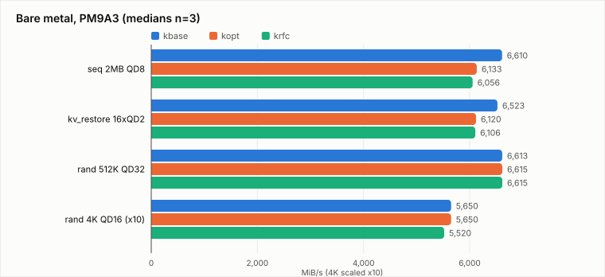
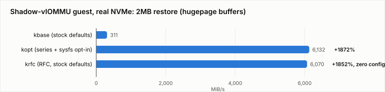
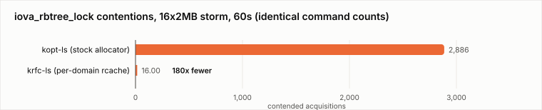

# Benchmarking the per-domain rcache RFC: opt-in performance at stock defaults

This document benchmarks the [6-patch per-domain IOVA rcache RFC](iova-feasibility.md)
against both the baseline kernel and the 3-patch opt-in series, across every
surface the original study measured: bare metal, three KVM topologies, the
kvio real-stack engine, lock contention, and package energy. All data from
one fresh bare-metal box (EPYC 9124, 2× PM9A3, 2× Micron 7450, AMD-Vi
translated DMA-FQ), one build config, upstream v7.2-rc1 base.

**Verdict up front**: the RFC delivers the opt-in series' performance on
every surface — bare metal within noise, the ~20× shadow-vIOMMU guest win
within 1% — **at stock defaults, with zero configuration**, and with the
allocator cost that motivated the original clamp measurably eliminated
(180× fewer contended acquisitions than the opt-in kernel under an
identical 2MB storm). The two approaches compose, but the RFC makes the
opt-in knob unnecessary on translated systems.

## 1. The three kernels

| | patches | how large requests happen |
|---|---|---|
| `kbase` | none (v7.2-rc1) | they don't: `max_hw = 128K` (the 3710e2b056cb clamp) |
| `kopt` | 3-patch series (`max_default_sectors` + nvme cap + PRP segments) | admin writes `max_sectors_kb=2048` |
| `krfc` | 6-patch RFC (per-domain rcache + `dma_set_opt_mapping_size()`) | **by default** — nvme hints its limit, the rcache grows, the existing clamp self-sizes |

Perf kernels carry no lock instrumentation; separate `-ls` builds
(`CONFIG_LOCK_STAT=y`) were used exclusively for the contention tables, per
the principle that lockdep-instrumented kernels must never produce
performance numbers.

## 2. Defaults verification (the RFC's core claim)

Boot-time gates, no sysfs writes anywhere:

| kernel | PM9A3 `max_hw` / `max_sectors_kb` | Micron 7450 | segments |
|---|---|---|---|
| `kbase` | 128 / 128 | 128 / 128 | 33 |
| `kopt` | 2048 / **128** (default preserved; opt-in required) | 4096 / 128 | 513 |
| `krfc` | **2048 / 2048 by default** | **4096 / 4096 by default** | 256 |

`krfc` self-sizes each device to its own MDTS — 2MB on the Samsung, 4MB on
the Micron — because `dma_opt_mapping_size()` now reports the per-domain
cached range after the driver's hint. The same held inside guests
(§4): the guest's translated domain grew to the emulated or passthrough
device's limit with no guest configuration.

## 3. Bare metal

Medians, n=3, preconditioned PM9A3, hugepage buffers:

| case | kbase | kopt (opted-in) | krfc (defaults) |
|---|---|---|---|
| seq 2MB QD8 | 6610 / 2.7ms p99 | 6133 / 3.0ms | 6056 / 3.0ms |
| kv_restore (16×QD2×2MB) | 6523 / 19.5ms p99 | 6120 / **10.9ms** | 6106 / **10.9ms** |
| rand 1MB QD16 | 6616 | 6552 | 6518 |
| rand 512K QD32 | 6613 | 6615 | 6615 |
| rand 4K QD16 | 565 | 565 | 552 |
| kv_qos 4K-victim p99 | 4.8ms | 21.6ms | 21.6ms |

`kopt` and `krfc` are equivalent on every case (≤1.3% apart). The
previously-characterized PM9A3 behaviors reproduce identically on both: the
[at-MDTS dip](regression.md) on streaming (−7 to −8% — avoidable via 1MB
sizing on this drive model), the kv_restore tail nearly halved, and the
same-device QoS penalty (which remains the argument for per-device policy —
and note `krfc` currently applies its default to *every* NVMe, which
sharpens the need for the RFC to grow, or the block layer to keep, an
opt-out; see §8).

## 4. KVM guest matrix

Three topologies × three guest kernels (host kernel constant), medians n=3:

| topology / case | kbase | kopt | krfc |
|---|---|---|---|
| **pt-pure** (no vIOMMU, control): seq2M huge | 6077 | 6107 | 6046 — *identical, as expected: no translation, no clamp, no effect* |
| **pt-shadow** (real NVMe, `caching-mode=on`): seq2M huge | 311 | **6132** | **6070** |
| pt-shadow: seq2M malloc (scattered) | 305 | 382 | 341 |
| pt-shadow: rand4K | 61 | 61 | 62 |
| **ram-viommu** (emulated NVMe, MDTS=512K): seq2M | 1640 | 4102 | 3049 |
| ram-viommu: rand512K | 1622 | 4220 | 2726 |

The study's headline reproduces under the RFC **at stock guest defaults**:
311 → 6070 MiB/s (+1852%), within 1% of the manually-opted-in series, with
the guest gate confirming `max_hw=msk=2048` self-sized inside the guest.
The contiguity dependence also reproduces (malloc buffers stay in the
~350 MiB/s scattered regime on all kernels — hugepage-backed staging
buffers remain mandatory for the superpage win, exactly as the study's
§7.3 found).

One honest anomaly: on the fully-*emulated* NVMe leg, `krfc` trails `kopt`
(3049 vs 4102) at identical command sizes. Both beat baseline heavily
(+86% / +150%). A plausible mechanism — cached IOVAs recycle addresses,
changing the shadow-invalidation pattern that a fully-emulated DMA path
must process — is unconfirmed; on real passthrough hardware the two are
equivalent, and that is the deployment-relevant case. Flagged for
investigation rather than explained away.

## 5. Lock contention: the reason the clamp existed

Separate `-ls` kernels, 16×2MB×QD8 randread storm, 60s, lock_stat around
the storm only. The `nvmeq->sq_lock` acquisition count independently
verifies each run's true device command count (a discriminator added after
a first measurement round failed internal consistency and was discarded):

| | kbase-ls (128K cmds) | kopt-ls (2MB cmds) | krfc-ls (2MB cmds) |
|---|---|---|---|
| device commands (sq_lock) | 3,455,205 | 210,556 | 208,206 |
| `iova_rbtree_lock` acq | 46,405 | **436,753** | **46,228** |
| `iova_rbtree_lock` contentions | 892 | **2,886** | **16** |
| worst wait | 7.8µs | 16.0µs | 2.6µs |
| avg hold | 0.31µs | 0.96µs | 0.42µs |
| per-CPU rcache acq / cont | 6.9M / 0 | 61K / 0 | 452K / **0** |

The three regimes in one table: `kbase` moves 16× the commands with every
IOVA cached (high traffic, cheap); `kopt` puts every 2MB alloc *and* every
flush-queue free on the rbtree (the 3710e2b056cb mechanism, alive: 2,886
contentions, 1µs holds); `krfc` moves the same 2MB commands with the
allocator back in per-CPU caches — **180× fewer contentions than `kopt` at
identical command counts**, rbtree reduced to first-fill traffic, zero
contention on the caches themselves. This is the feasibility study's
kvls/kvrc result reproduced as a clean same-box three-way, and it is the
answer to "is it safe": the RFC doesn't make the contention tolerable, it
makes the traffic not exist.

## 6. kvio (`raw-block-parallel-load` branch, Llama-3.1-405B)

The GPU-free 405B harness grafted onto the new engine (the branch replaced
the standalone runner with a GPU-requiring serving A/B; the graft drives
the new `RawBlockCore` directly). Three results:

1. **The CQ-overflow hang is fixed on this branch.** The exact reproducer
   we [root-caused](kvio-hang-report.md) (126MiB object, 1009 uring_cmd
   commands, default split) **completes on all three kernels** (~233ms
   store), where the `kvio` branch stranded completions in the kernel
   overflow list indefinitely. Independent confirmation that the
   parallel-load rework addresses the reported bug.
2. **Passthrough load at 3.7 GB/s, kernel-independent**: the new batched
   load path (`uring_cmd`, 2MB commands) hits 3.67–3.76 GB/s on all three
   kernels — the char-device passthrough path is bounded by controller
   MDTS, not by the block-layer limits our patches change; a good negative
   control, and 5.4× the store path (~890 MB/s), matching the branch's own
   load-focused intent.
3. **The block-device path is engine-bound on this branch** (~390 store /
   ~700 load MB/s regardless of kernel *or* engine split size — QD~1
   serialization in the non-passthrough path), so it cannot discriminate
   kernels. The old branch's block path ran 2× faster; regression noted
   for upstream.

## 7. Package energy (RAPL)

**Method**: powercap package-domain energy counter
(`/sys/class/powercap/intel-rapl:0/energy_uj`, RAPL-compatible MSRs on this
EPYC), endpoint-integrated per 30s case with wraparound handling, 2Hz
timeline sampler, idle floor derived from the quietest 5s window of each
boot's timeline (the naive post-boot "idle" window proved contaminated by
settling — one boot's marginal numbers went negative before this
correction). Scope: CPU package only — interrupt/completion/IOMMU
processing and data-movement uncore; not the drive, not wall power.

| case | kbase | kopt | krfc |
|---|---|---|---|
| package W under load (all cases 512K–2M) | 49.3–49.5 | 49.6–49.8 | 49.2–49.4 |
| marginal J/GiB, seq 2MB | 4.92 | *(floor contaminated¹)* | 5.67 |
| marginal J/GiB, rand 512K | 4.95 | ¹ | 5.24 |
| marginal J/GiB, rand 4K | 56.4 | ¹ | 60.8 |

¹ The `kopt` boot's RAPL timeline never dropped below 47W (background
activity for its whole session), so its idle-relative marginals are
unusable; its *absolute* watts match the other kernels within 1%.

**The honest bare-metal energy conclusion: parity.** At saturation the
package draws ~49.5W under this I/O regardless of kernel — on raw-device
reads, data movement itself dominates package power, and the per-command
CPU savings are below RAPL's resolution at these rates. This contrasts
deliberately with the *virtualized* result from the study (49 → 5.4 J/GiB,
9×, fig8), where per-4K shadow page-table work — pure CPU — dominated. The
energy argument for large requests is a virtualization and CPU-headroom
argument, not a bare-metal package-power one; the earlier −72% sys-CPU
findings on stacked paths return cores, not directly watts.

## 8. Limitations and errata

- The RFC self-sizes **every** NVMe on translated systems, including OS
  drives. Given the per-drive firmware findings ([regression.md](regression.md):
  PM9A3-class dips at MDTS, 7450-class gains), a future revision should
  keep `max_default_sectors`-style per-device policy composable — the two
  patch sets are complementary, not competing (`kopt`'s knob becomes a
  *limiter* under `krfc` rather than an enabler).
- ram-viommu `krfc`-vs-`kopt` gap (§4): unexplained, flagged.
- kvio block path engine-bound (§6): cannot discriminate kernels on this
  branch.
- Energy: `kopt` marginals lost to floor contamination; single-socket
  package scope only.
- First lock-measurement round discarded (internal inconsistency caught by
  the command-count discriminator); round two, reported here, verifies.
- Guest matrix ran one boot per cell (n=3 within-boot); bare metal n=3
  single boot per kernel. Spreads were tight throughout (typically <2%).

## 9. Artifacts

`data/rfc-bench-results.tgz` (bare metal + lock round 1),
`data/rfc-guest-results.tgz` (9-cell guest matrix),
`data/rfc-kvio-results.tgz` + `data/rfc-phaseE-results.tgz` (kvio, energy,
lock round 2, RAPL timelines). Kernels: upstream v7.2-rc1 +
`dma-opt-clamp-data/{0001,0002,prp}` (series) / `rfc-iova/` (RFC).
